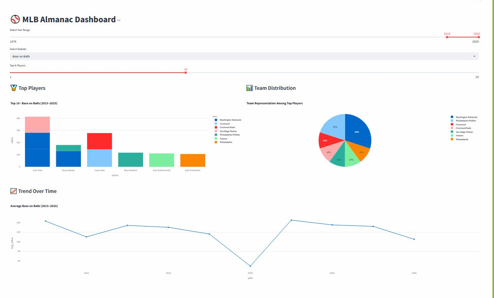

# final-project-web-scraping

## MLB Almanac Dashboard
An interactive dashboard built with Streamlit to explore MLB statistics from 1876 to 2025.

## Features
### Three Visualizations:
Bar chart: Top players for a selected statistic
Pie chart: Team distribution among top players
Line chart: Statistic trend over time

### Interactive Controls
Dropdown: Select statistic
Slider: Choose number of top players
Year range selector: Filter by year span

### Data Source:
SQLite database created from 150+ CSV files with cleaned MLB statistics

### Tech Stack

- Python
- Streamlit
- SQLite
- Pandas
- Plotly

### Files
import_to_db.py – Imports and cleans data into a SQLite database.
dashboard.py – Interactive dashboard (main file).
data/raw/ – Folder for raw CSV files.
mlb_almanac.db – SQLite database (auto-generated).

### How to run
```bash
pip install -r requirements.txt
streamlit run dashboard.py
```




### Summary:
This project stores MLB stats in a database and shows interactive charts to explore the data by year and statistic.